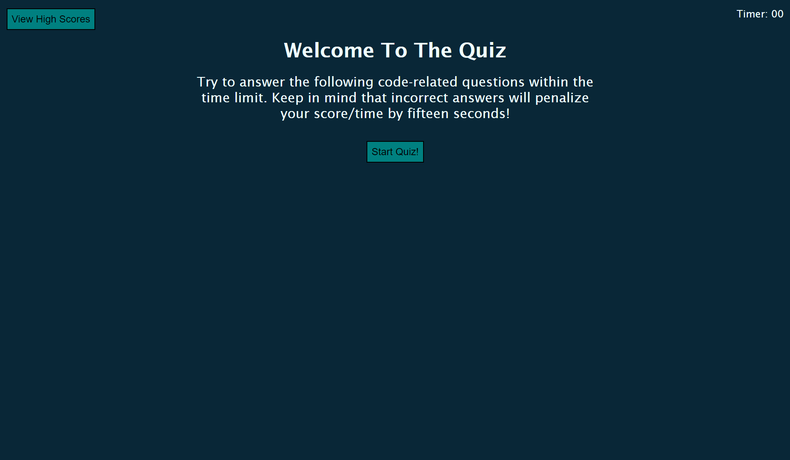
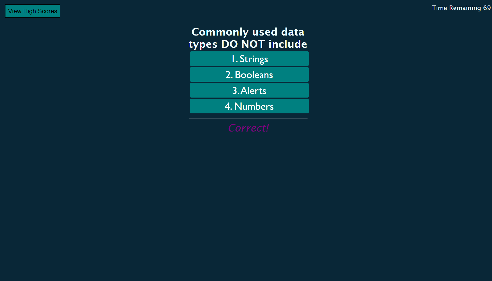
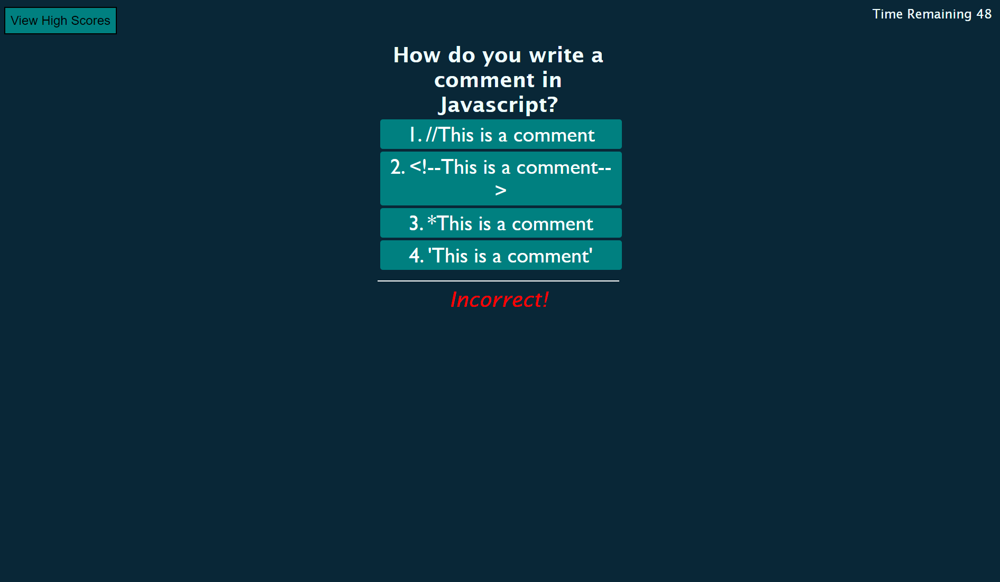

# smarter-than-machines

Can you outsmart this quiz?

# Description 

For this challenge, I have built a functioning multiple choice test. This test contains 5 questions, that gives you 15 seconds per question to answer. The test will start off with a title screen, with a brief description of what is expected. Once the start button is clicked, the page will refresh with a newly presented question, as well as initiate the timer. Each question will contain 4 possible answer. If you select the right answer, you will be prompted with Correct! underneath your answer. However, if the wrong answer is selected, you will be prompted with Incorrect! underneath your answer, as well as having 15 seconds knocked off of your time remaining. 

Once all of the questions have been answered. You will be scored for the quiz. Your score will equal the time remaining of the quiz. The questions will clear from the screen once all questions are answered. The new screen will prompt you to enter your initials to save in the highscores section. These are also logged inside of inspector under the applications/local storage folder. Once you have entered your initials, they will display inside highscores where you can delete your previous scores, or return to the quiz for another attempt. 

# Screenshots

# Links

github - https://github.com/GrindBoiWes/smarter-than-machines

Website - https://grindboiwes.github.io/smarter-than-machines/

# Credit

Ton's of help from fellow classmates, as well as askBCS. Youtube videos and stackoverflow were also heavily relied upon for this challenge.